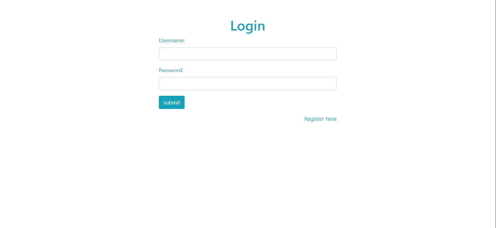
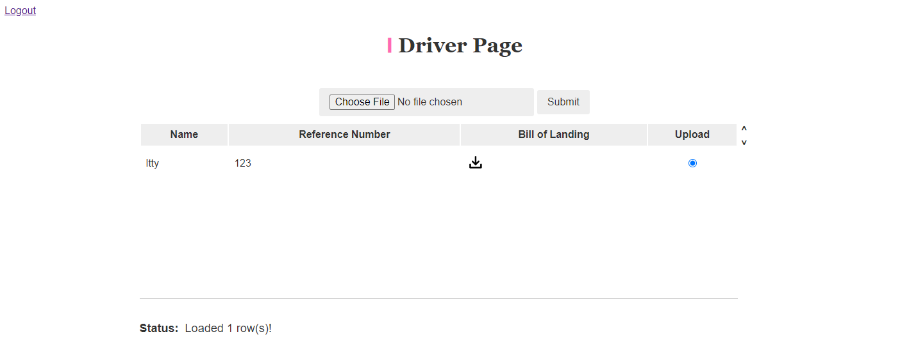
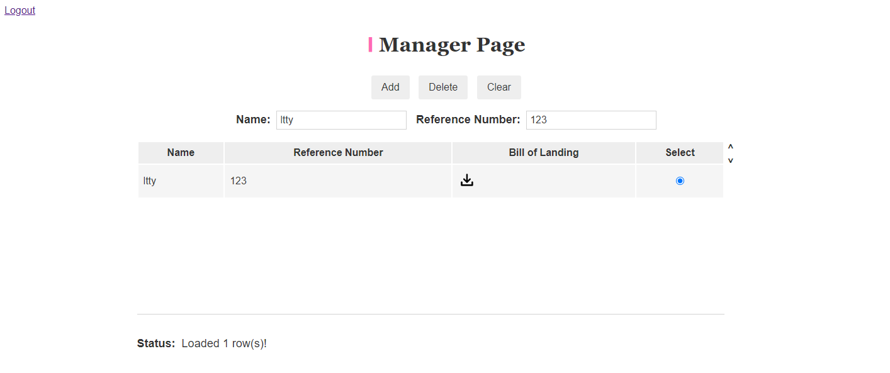

# Logistic Application

Simple inventory tracking web application for logistics company.

# Propose

Logistic service platform offering services to help manage the supply chain including warehouse management, order fulfillment, and shipping orders. The platform allows logistics company managers and drivers to view, update, and post-delivery information.

# Functionalities and work division:

User registration/login @Yunxiao Li

Managers can assign and modify new deliveries for each driver @Tianyu Lu

Drivers can view their delivery assignments and click finish when their job is done but need to upload images as proof. @Yunxiao Li

# Check It Out

https://intense-lowlands-69751.herokuapp.com/

# Install, Build & Run

- Install [Node](https://nodejs.org) and [npm](https://www.npmjs.com) on your machine
- Clone the repository: `git clone https://github.com/TimLu7/logistic-backend.git`
- Install dependencies: `npm install`
- Run Node server: `npm start`
- Open `http://localhost:3000/` on your browser to see the web application

# Screenshots

1. Login Page

   

2. Register Page

   

3. Driver Page

   

4. Manager Page

   

# Author

Tianyu Lu &&
Yunxiao Li

# Class link

https://johnguerra.co/classes/webDevelopment_fall_2022/
